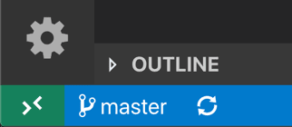
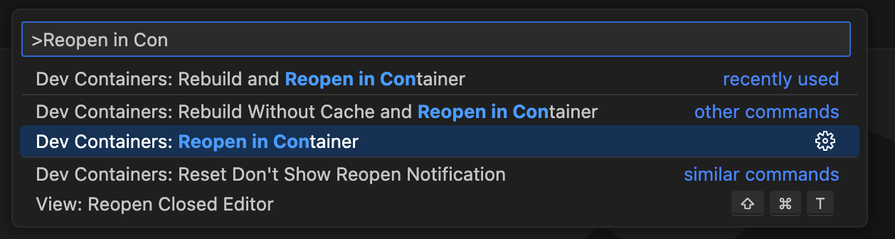

# CS1100 Blank Workspace

## Dev Containers

Imagine you're working on a project with a bunch of tools, libraries, and settings on your computer. But then, you pass that project to a friend, and they can't get it to work on their computer because their setup is a little different from yours. This is a common issue in software development, and development containers help solve it.

A development container is like a mini-computer inside your computer. It has its own environment, including a specific operating system, versions of programming languages, tools, libraries, and configurations that the project needs to run properly. By putting your project inside this container, you can make sure it works the same way for everyone, regardless of their computer's setup.

Many development environments, like Visual Studio Code, support development containers. This means you can open a project, and it will set up the container for you automatically.

#### Install Docker and Dev Containers

1. You need [Visual Studio Code](https://code.visualstudio.com/) installed
2. Install and configure [Docker Desktop](https://www.docker.com/products/docker-desktop/) for your operating system.
3. Run the Docker Desktop application to start Docker. You will know it's running if you look in the activity tray and see the Docker whale icon. Docker might take a few minutes to start. If the whale icon is animated, it is probably still in the process of starting. You can click on the icon to see the status.
4. Once Docker is running, you can confirm that everything is working by opening a new terminal window and typing the command:

```
$ docker --version
```

5. Install the [Dev Containers extension](https://marketplace.visualstudio.com/items?itemName=ms-vscode-remote.remote-containers)
6. Check installation. With the Dev Containers extension installed, you will see a new Status bar item at the far left.



#### Open in Dev Container

1. Start VS Code and open the code for your repository.
2. Run the **Dev Containers: Reopen in Container** command from the Command Palette (F1) or quick actions Status bar item.



3. The VS Code window will reload and start building the dev container. A progress notification provides status updates. You only have to build a dev container the first time you open it; opening the folder after the first successful build will be much quicker.


4. After the build completes, VS Code will automatically connect to the container. Your terminal should for ubuntu linux no matter what your computer operating system is and all necessary tools shoul dbe installed for you.
